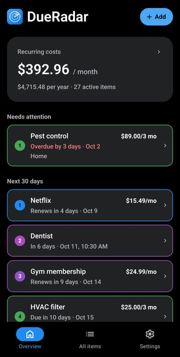
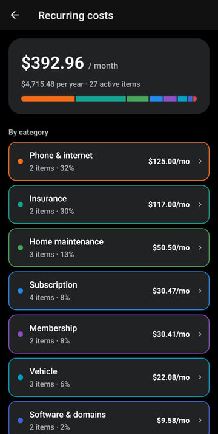
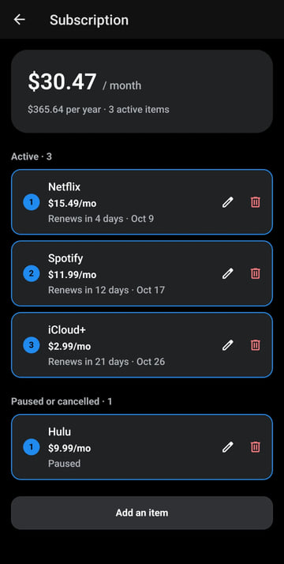
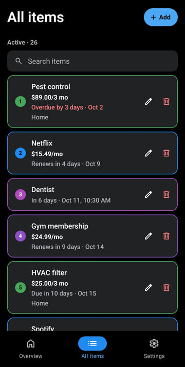
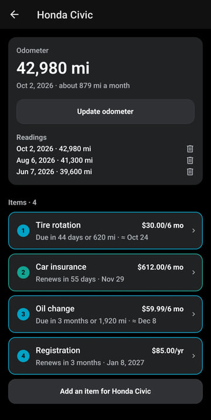
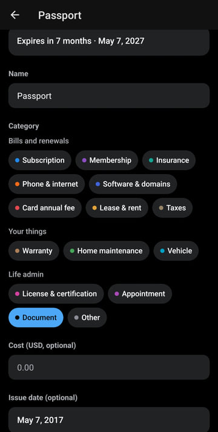
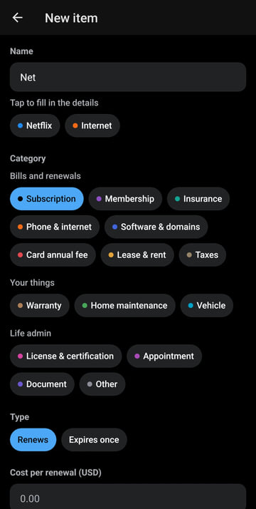
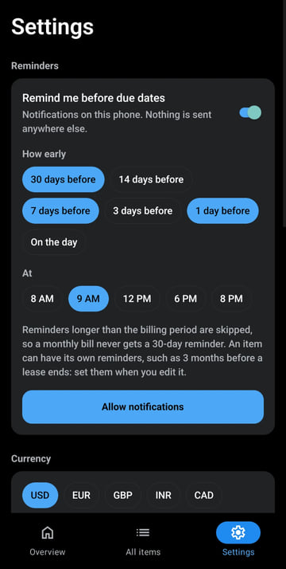

# DueRadar

See what's coming before it's due.

DueRadar is a free, open-source app that makes sure you never miss a renewal, price increase or expiry. It tracks what you pay for again and again (subscriptions, memberships, insurance, phone plans, domains, card annual fees), the upkeep of your home and car, and the dates that matter.

**Private by design:** there are no accounts and no server, and nothing to sign up for. Your data is stored in a SQLite database on your own device and never leaves it.

> Status: early development. Not yet in the app stores.

## Screenshots

<p>
  
  
  
  
  
  
  
  
</p>

## Features

Working now:

- Add, edit and delete items with cost, frequency, next renewal or expiry date, and an auto-renew flag. Deleting asks first, and leaving a form with unsaved changes asks whether to save them
- Quick-add: start typing "Net…" and pick Netflix to fill in the category and frequency (100+ common services, products, maintenance tasks and life admin)
- Overview with monthly and yearly recurring cost, what's due in the next 30 days, and what needs attention
- Costs by category: tap the recurring cost to see what each category costs a month and its share, then a category to see, edit or delete its items
- Auto-renewing items move to their next date by themselves. Manual renewals are flagged as overdue until you mark them renewed
- Price history: every cost change is recorded (for example $55 → $65 → $80), and the Overview lists the items whose price went up
- All items: search by name, company, category or notes, with edit and delete on every row. Rows are numbered in their category's color
- Warranties: purchase date, price, store, warranty length (1, 2, 3 or 5 years sets the end date) and a photo of the receipt, with reminders before the warranty ends
- Home and vehicle maintenance: tasks that repeat when done, like an HVAC filter every 3 months or an oil change every 6 months or 10,000 km. Mark a task done and its next date counts from that day. Each time is kept in its history, with the cost and odometer reading
- Vehicles and homes: group items under your car or home, keep the odometer up to date, and see services due by distance. From a few readings, DueRadar estimates when a distance will be reached and reminds you before then
- Life admin: licenses and certifications (with an issue date and "valid for" length), appointments with a time of day, rent and lease ends, and tax deadlines you mark as done each time. Past appointments move to their own list instead of showing as overdue
- Reminders: notifications on the phone 30, 7 and 1 days before (configurable), at the time you choose. Any item can have its own reminders instead, such as 3 months before a lease ends. A reminder on the day of an appointment comes at least an hour before it. A reminder longer than the billing period is skipped
- Documents: passports, visas, ID cards and certificates, with their expiry date (or none, for a birth certificate) and reminders 6 months ahead. Adding photos of the document is optional; they're encrypted on the phone with AES-256 and a key kept in the phone's secure storage
- App lock: ask for the fingerprint, face or phone PIN when DueRadar opens, and again after a minute away
- Backup: export a JSON backup (including receipt photos, vehicles and history, and document photos if you choose) or a CSV spreadsheet, and restore from a backup on a new phone
- Your currency for new items (USD, EUR, GBP, INR and more)
- Light and dark mode. Runs on iOS, Android and the web (reminders, photos and the app lock need the phone app)

## Tech stack

| Area       | Choice                                                      |
| ---------- | ----------------------------------------------------------- |
| App        | [Expo](https://expo.dev) (React Native) + TypeScript        |
| Navigation | Expo Router (file-based), native tabs                       |
| Storage    | `expo-sqlite` on the device, with versioned migrations      |
| Reminders  | `expo-notifications`, scheduled locally on the device       |
| Backup     | `expo-file-system`, `expo-sharing`, `expo-document-picker`  |
| Photos     | `expo-image-picker` (camera or photo library), stored in the app's own folder |
| Documents  | `expo-crypto` (AES-256-GCM) with the key in `expo-secure-store`     |
| App lock   | `expo-local-authentication` (fingerprint, face or the phone's PIN)  |
| Tests      | Jest (`jest-expo`) for dates, money, reminders, templates, backups, search, price insights, costs by category, tasks and distances |

## Project structure

```
src/
  app/            Screens (Expo Router). Every file is a route.
    (tabs)/       Overview, All items and Settings tabs
    item/         Add item (modal), Edit item and Mark as done screens
    asset/        Add or edit a vehicle or home, with its odometer and items
    costs.tsx     Recurring costs by category
    category/     A category's items
  attachments/    Picking and storing photos, and encrypting document photos
  components/     UI building blocks (form controls, item row, date field)
  db/             SQLite migrations, queries, settings and backup restore
  domain/         Pure logic with no React or database: dates, money, schedules,
                  dashboard, reminder planning, templates, backup format
  hooks/          React hooks (theme, data loading)
  notifications/  Scheduling reminders (a no-op on the web)
  security/       App lock (a no-op on the web)
  utils/          Dialogs, navigation, saving and opening files
docs/             Website and privacy policy (GitHub Pages)
fastlane/         Google Play listing text and graphics
scripts/          Icon generator (make-icons.js)
```

## Data model

Everything you track is an **item** with a key date. One shared table covers the whole roadmap, so later versions add categories and fields, not new apps.

| Table            | Purpose                                                                                           |
| ---------------- | ------------------------------------------------------------------------------------------------- |
| `items`          | Name, category, cost, schedule, due date and time (and for vehicle tasks, distance), status, its own reminder days, and the vehicle or home it belongs to |
| `price_history`  | Each price an item has had, with the date it took effect                                          |
| `completions`    | Each time a task was done or a renewal confirmed, with the cost, odometer reading and a note      |
| `assets`         | Vehicles and homes that items can belong to, with a vehicle's odometer unit                       |
| `usage_readings` | Odometer readings of each vehicle                                                                 |
| `attachments`    | Receipt photos, and document photos (encrypted), stored in the app's private storage              |
| `settings`       | App preferences, such as the default currency                                                     |

An item's schedule is one of:

- `recurring`: renews on a fixed schedule, like a subscription. Its next date is always computed from the date you entered, so a bill on the 31st comes back to the 31st after a short month instead of drifting to the 28th.
- `task`: repeats a set time after it's done, like an HVAC filter. Marking it done moves the next date to that day plus the interval. A vehicle's task can also be due by distance (whichever comes first), and the average distance per day from recent odometer readings estimates when that will be.
- `expiry`: a single date, like a warranty, a license or an appointment. An appointment's date can have a time, and once it has passed it's simply over instead of overdue.

Dates are stored as local `YYYY-MM-DD` strings and amounts as integer cents.

## Getting started

Requirements: Node.js 20+.

```bash
npm install
npm start
```

Then scan the QR code with the [Expo Go](https://expo.dev/go) app on your phone, or press `w` to open it in a browser.

| Command             | What it does          |
| ------------------- | --------------------- |
| `npm start`         | Start the dev server  |
| `npm test`          | Run unit tests        |
| `npm run typecheck` | TypeScript check      |
| `npm run lint`      | ESLint                |

### Building an Android APK

Builds run on [EAS Build](https://docs.expo.dev/build/introduction/) and need a free Expo account:

```bash
npx eas-cli@latest build -p android --profile preview
```

The `preview` profile makes an installable APK. The `production` profile makes an app bundle (.aab) for Google Play.

### Regenerating the icons

The icons, including the Google Play icon and feature graphic, are drawn in code. After changing the design in `scripts/make-icons.js`:

```bash
npm install --no-save sharp
node scripts/make-icons.js
```

## Privacy

DueRadar has no accounts, no analytics and no server. See the [privacy policy](docs/privacy.md).

## License

[MIT](LICENSE)
