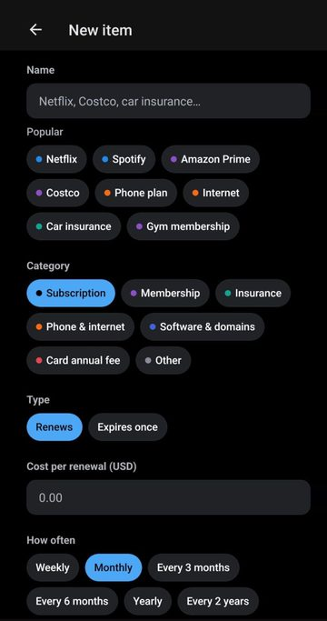
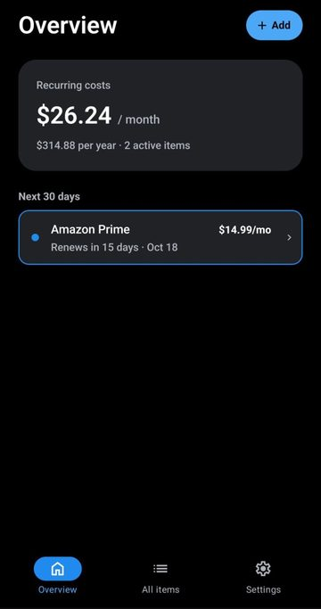
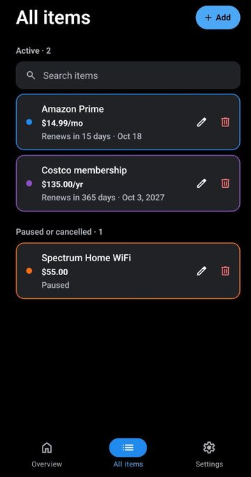
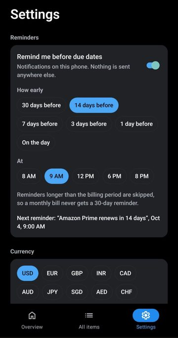

# DueRadar

See what's coming before it's due.

DueRadar is a free, open-source app that makes sure you never miss a renewal, price increase or expiry. It tracks what you pay for again and again (subscriptions, memberships, insurance, phone plans, domains, card annual fees) and the dates that matter.

**Private by design:** there are no accounts and no server, and nothing to sign up for. Your data is stored in a SQLite database on your own device and never leaves it.

> Status: early development. Not yet in the app stores.

## Screenshots

<p>
  
  
  
  
</p>

## Features

Working now:

- Add, edit and delete items with cost, frequency, next renewal or expiry date, and an auto-renew flag
- Quick-add: start typing "Net…" and pick Netflix to fill in the category and frequency (40+ common services)
- Overview with monthly and yearly recurring cost, what's due in the next 30 days, and what needs attention
- Auto-renewing items move to their next date by themselves. Manual renewals are flagged as overdue until you mark them renewed
- Price history: every cost change is recorded (for example $55 → $65 → $80), and the Overview lists the items whose price went up
- All items: search by name, company, category or notes, with edit and delete on every row
- Reminders: notifications on the phone 30, 7 and 1 days before (configurable), at the time you choose. A reminder longer than the billing period is skipped
- Backup: export a JSON backup or a CSV spreadsheet, and restore from a backup on a new phone
- Your currency for new items (USD, EUR, GBP, INR and more)
- Light and dark mode. Runs on iOS, Android and the web (reminders need the phone app)

Planned:

- Warranties (V2), home and vehicle maintenance (V3), licenses and life admin (V4), and an optional encrypted document vault (V5)

## Tech stack

| Area       | Choice                                                      |
| ---------- | ----------------------------------------------------------- |
| App        | [Expo](https://expo.dev) (React Native) + TypeScript        |
| Navigation | Expo Router (file-based), native tabs                       |
| Storage    | `expo-sqlite` on the device, with versioned migrations      |
| Reminders  | `expo-notifications`, scheduled locally on the device       |
| Backup     | `expo-file-system`, `expo-sharing`, `expo-document-picker`  |
| Tests      | Jest (`jest-expo`) for dates, money, reminders, templates, backups, search and price insights |

## Project structure

```
src/
  app/            Screens (Expo Router). Every file is a route.
    (tabs)/       Overview, All items and Settings tabs
    item/         Add item (modal) and Edit item screens
  components/     UI building blocks (form controls, item row, date field)
  db/             SQLite migrations, queries, settings and backup restore
  domain/         Pure logic with no React or database: dates, money, schedules,
                  dashboard, reminder planning, templates, backup format
  hooks/          React hooks (theme, data loading)
  notifications/  Scheduling reminders (a no-op on the web)
  utils/          Dialogs, navigation, saving and opening files
docs/             Website and privacy policy (GitHub Pages)
fastlane/         Google Play listing text and graphics
scripts/          Icon generator (make-icons.js)
```

## Data model

Everything you track is an **item** with a key date. One shared table covers the whole roadmap, so later versions add categories and fields, not new apps.

| Table           | Purpose                                                                                           |
| --------------- | ------------------------------------------------------------------------------------------------- |
| `items`         | Name, category, cost, schedule (`recurring`, `expiry` or `usage`), due date, status, optional parent item |
| `price_history` | Each price an item has had, with the date it took effect                                          |
| `reminders`     | Per-item reminder offsets and their scheduled notification IDs                                    |
| `attachments`   | Receipts and documents stored in the app's private storage (later versions)                       |
| `settings`      | App preferences, such as the default currency                                                     |

Dates are stored as local `YYYY-MM-DD` strings and amounts as integer cents. A repeating date is always computed from the date you entered, so a bill on the 31st comes back to the 31st after a short month instead of drifting to the 28th.

## Getting started

Requirements: Node.js 20+.

```bash
npm install
npm start
```

Then scan the QR code with the [Expo Go](https://expo.dev/go) app on your phone, or press `w` to open it in a browser.

| Command             | What it does          |
| ------------------- | --------------------- |
| `npm start`         | Start the dev server  |
| `npm test`          | Run unit tests        |
| `npm run typecheck` | TypeScript check      |
| `npm run lint`      | ESLint                |

### Building an Android APK

Builds run on [EAS Build](https://docs.expo.dev/build/introduction/) and need a free Expo account:

```bash
npx eas-cli@latest build -p android --profile preview
```

The `preview` profile makes an installable APK. The `production` profile makes an app bundle (.aab) for Google Play.

### Regenerating the icons

The icons, including the Google Play icon and feature graphic, are drawn in code. After changing the design in `scripts/make-icons.js`:

```bash
npm install --no-save sharp
node scripts/make-icons.js
```

## Privacy

DueRadar has no accounts, no analytics and no server. See the [privacy policy](docs/privacy.md).

## License

[MIT](LICENSE)
